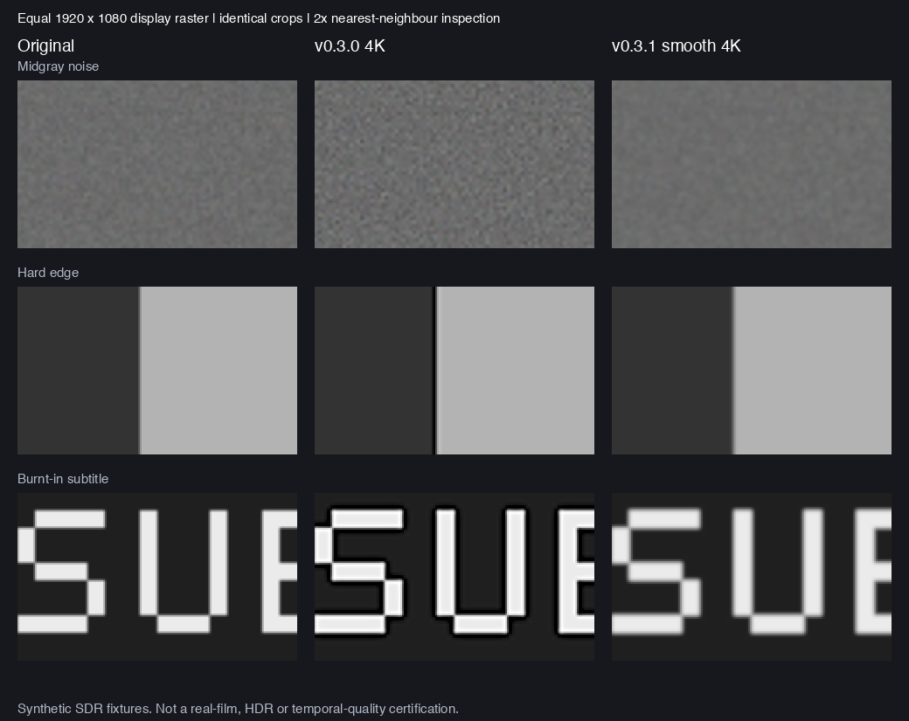

# 映川 v0.3.1 · 统一应用与自然画质

日期：2026-09-28。版本 0.3.1 / build 13。目标是整合原有功能与新版播放页，并修复增强后噪点比原片明显的问题。

## 整合与交互

v0.3.0 本身继承 v0.2.9 的片库、媒体检索、字幕、历史、广告处理、HDR/杜比路由；此前分开的是发行入口。本轮统一为 `dist/映川.app`，保留 `local.yingchuan.cinema` 身份和原有存储路径。构建脚本先生成完整且签名通过的暂存应用，再将旧应用移动到 `dist/历史版本/`；检测到运行中副本就保留暂存并停止替换，安装失败会回滚。

- 播放页、画质工作室、视听适配使用同一个画面模式选择入口。菜单勾选表示所选模式，底栏状态表示实际输出；等待处理、HDR 原生直通和处理失败均不冒充已增强。
- 底栏半圆按钮临时显示原片，再点恢复所选模式；不修改持久偏好，不替换媒体项、进度、字幕和播放意图。换片退出对照。
- 展开选集时，底栏省去重复的下一集按钮（侧栏仍保留），时间显示缩为已播时长；完整时间保留在辅助功能与提示中。保持原有大按钮和控制栏自动隐藏策略。
- 新用户默认原片，并记住自然降噪作为轻度增强选项；已有明确偏好保留。现有 4K 偏好会使用改进后的算法。

参考 [IINA / mpv / Jellyfin 的公开项目与文档](research/natural-picture-and-player-ux.md)，采用独立实现，没有复制外部代码或引入新播放内核依赖。

## 噪点根因与修改

旧路径中 `CINoiseReduction` 的 `inputSharpness=0.2` 后又叠加 `CISharpenLuminance=0.35`，放大路径使用 Lanczos。固定合成样本复现了中灰和彩色区域噪声误差上升，以及硬边过冲。相邻像素变化变大不能直接作为细节改善证据；旧亮度脚本的“并非无效果”结论已改为只报告它实际检查的平均亮度。

新版关闭降噪器的附带锐化，移除后级亮度锐化；“自然降噪”保留源尺寸。“平滑 4K 缩放”在轻度降噪后使用无负权重的 B-spline 插值，仅在目标尺寸需要增大时缩放。已有 3840×2160 / 4096×2304 输入不再额外做 scale=1 插值，避免白白损失细节。硬字幕随视频参与处理，外挂字幕仍独立绘制；广告柔化依然最后执行。

HDR / Dolby Vision 继续交给系统原生路径。增强路径虽请求 10bit 解码并使用浮点显示层，但 `EnhancementPipeline` 的中间纹理仍为 `bgra8Unorm`；本轮没有实现完整 10bit HDR 增强、SDR 转杜比、时域降噪或通用 AI 4K 修复。

广告柔化的精确像素回归发现，直接将柔化分支合成进 Core Image 渲染图会令 4K 框外 335,520 个像素、字幕保护区 97,114 个像素产生最多 1 码值的舍入差。现改为先渲染不可变基底，再用限定范围的 Metal 纹理复制写入各柔化选区；只有存在有效选框时增加这一步。框外和保护区差异已归零，非居中上下颜色、旋转及重叠框顺序也通过检查。[失败证据](validation/v0.3.1/ad-cleanup-red.json)与[修复后结果](validation/v0.3.1/ad-cleanup.json)分别保存。

另修复处理回退后无法恢复的问题：Apple AI 输入不支持或超出帧预算后，切换其他模式会重新尝试；HDR sticky、原生权限和方向读取失败仍不能被模式选择解除。

## 固定像素样本的结果

同一个 960×540 SDR 输入，统一到 1920×1080 显示网格后比较 RGB 均方误差（越低越接近已知干净参考）。原片列使用同一个 GPU 输出/读回流程作为空间比较基准，不等同于对系统 AVPlayer 原生显示的测量。

| 合成区域 | 原片基准 | 旧清晰 | 新自然降噪 | 旧 4K | 新平滑 4K |
| --- | ---: | ---: | ---: | ---: | ---: |
| 暗场亮度噪声 | 11.771 | 8.693 | 4.322 | 9.334 | 3.085 |
| 中灰亮度噪声 | 11.517 | 24.508 | 10.615 | 28.327 | 6.201 |
| 彩色噪声 | 10.266 | 19.312 | 8.503 | 22.098 | 4.980 |

新版两个档位在 960 与 1920 两个显示网格上均通过噪声、亮度、硬边、条纹对比度与字幕笔画阈值。1920 网格上，新 4K 的硬边过冲为 0（旧 4K 为 51 个 8bit 码值）；边缘 10–90% 宽度从原片 2.20 到 3.11 像素，显示出平滑带来的软化取舍。8 像素条纹对比度保留 96.9%，硬字幕笔画召回 100%，背景阈值泄漏 0.22%。这些是工程夹具指标，不能证明每部真实影片、运动画面、肤质和胶片颗粒都会改善。



图片为相同区域裁剪后用最近邻放大 2 倍以便观察，未再进行锐化。完整数值见 [旧版基线](validation/v0.3.1/quality-old-1920.json)、[新版 1920](validation/v0.3.1/quality-final-1920.json)、[新版 960](validation/v0.3.1/quality-final-960.json)。原生 4K 尺寸回归曾先失败（相对自然降噪多出 70 码值差异），修复后两个尺寸的差异均为 0，记录见 [失败基线](validation/v0.3.1/native-resize-red.json)。

可复现命令：

```bash
bash scripts/validate-picture-quality.sh /tmp/picture-960.json
bash scripts/validate-picture-quality.sh /tmp/picture-1920.json Sources/CinemaApp/EnhancementPipeline.swift 1920
```

旧算法来自提交 `8b291f4` 的 `Sources/CinemaApp/EnhancementPipeline.swift`；脚本第二个参数可指定提取出的旧源码。完整 PNG 输出在报告相邻 `.frames` 目录；仓库仅保留上方对比图，避免重复保存所有大图。

## 性能与回归

Apple M4、实际完成 GPU 工作的 240 帧 1280×720 合成测试：

| 模式 | 实际输出 | 平均 / P95 | 说明 |
| --- | --- | --- | --- |
| 自然降噪 | 1280×720 | 1.01 / 2.05 ms | 完成 240 帧 |
| 平滑 4K 缩放 | 3840×2160 | 2.05 / 2.17 ms | 完成 240 帧 |
| Apple AI ×1.5 | 1920×1080 | 14.35 / 3.95 ms | 首帧 2566.71 ms；预热后平均 3.67 ms |

[性能原始报告](validation/v0.3.1/gpu-benchmark.json)只衡量合成 SDR 帧处理，包含等待 GPU 完成；不是真实网络影片帧率、音画同步或长时间播放验收。Apple AI 的较慢首帧不能被预热平均值掩盖，模式也未保证输出 4K。

| 检查 | 本轮结果与边界 |
| --- | --- |
| Swift 核心测试 | 153 项、19 套件通过 |
| 真实 PlaybackController 画质切换 | 12 项通过；含原片对照、持久偏好隔离、暂停时重复选择不清空状态；渲染状态使用注入指标，实际 surface 另测 |
| AVPlayer / CinemaVideoView 路由 | 24 项通过；SDR、PQ/HLG、原片开关、权限撤销、普通本地 HLS、Apple AI 128×72 不支持后切换恢复；不验证杜比实屏效果 |
| 控制栏隐藏 | 12 项通过；真实控制器计时器，无物理指针注入 |
| 广告柔化像素 | 管线四种模式/方向的框外与字幕保护区差异均 0；裁切取样隔离、非居中上下方向、重叠多框顺序均通过。不是 OCR 广告识别准确率测试 |
| 被动媒体检查 | 异步访问器静态校验通过 |
| 原生 UI | 最终隔离 QA 应用构建记录见交付核验。本机锁屏且 UI 工具无法解锁，因此本轮未完成新增按钮、窄窗与全屏的实际目视/鼠标验收；不能沿用 v0.3.0 截图充作本轮通过 |

详细报告位于 [v0.3.1 验证目录](validation/v0.3.1/)。本轮不新增网络片源，也未重新核验现有来源在大陆各网络上的持续可用性。真实杜比输出、真实广告准确率和完整剧集观看仍保留历史验证边界。

## 最终交付核验

- 已安装统一入口 `dist/映川.app`，版本 0.3.1 / build 13；Release 编译和严格签名核验通过，最终独立原生 QA 应用也构建并签名通过。
- `dist/映川-v0.3.1.zip` 通过全文件 CRC、UTF-8 中文文件名和源文件字节核对；macOS `ditto` 解包后，可执行权限、全部文件字节与严格签名检查均通过。
- 原 v0.2.9 / build 11 与 v0.3.0 / build 12 已移入 `dist/历史版本/`；备份的全部文件哈希与移动前一致。
- 发行安装前后，实际存在的 1 个片库 JSON 文件哈希一致；没有为安装读取或修改用户偏好域。历史/待看存储路径和偏好键保持兼容，偏好行为另由隔离控制器测试验证。
- 最终发布可执行程序完成上述 240 帧/档位基准。安装和压缩包清单见 [release-manifest.json](validation/v0.3.1/release-manifest.json)，安装脚本的运行保护、备份碰撞和失败回滚另有 [5 项夹具检查](validation/v0.3.1/install-fixtures.json)。
- 本机锁屏阻止原生 UI 工具启动验收；新增控件的实际窗口观感与物理鼠标交互尚未完成。本轮没有以构建或无窗口测试代替这些项目。
