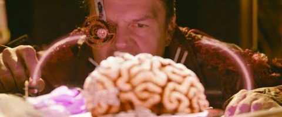

# v0.3.6 可选残噪清理

日期：2026-09-29。沿用用户已授权的流式画质优化，新增可选「压缩抑噪」实验档。没有证明它普遍优于现有流式修复，故不覆盖默认值或已保存选择。

## 怎么使用

播放 → 画质 → 处理模式 → **压缩抑噪**。目标分辨率、帧率、同帧分屏和本机处理自检继续可用。先尝试跟随片源帧率；可用原片对照判断是否喜欢更柔和的处理。清晰片源及重视细纹理时仍可选原片或原来的流式修复。

处理顺序为：当前 SDR 解码帧 → 现有时域降噪 → 源尺寸受限残噪清理 → 现有 AI/细节缩放 → 显示。清理器不增加未来帧等待、不叠加锐化、不保留历史帧；输出独立且 GPU 完成后才返回。阈值使用 sRGB 编码亮度，最大修正 2 个8-bit等价码值；half中间存储保留扩展 SDR，沿用最终紧凑10-bit输出。

新清理器固定排除画面下方28%，叠加已有保护区，向外扩张2像素并羽化外边界。这里的“保护”仅指**不做新增清理步骤**，不代表时域、缩放及插帧都逐像素不动，也不是全画面字幕识别。无可靠显示尺寸时等待原片；不支持的像素比例/裁切几何会停止该模式并显示原因。HDR/杜比继续系统原生呈现。

## 质量收益与代价

比较 guided filter 与受限差分之后，采用方向门控更保守的受限差分；不是 AV1 CDEF 的位精确实现，也不是 AI 模型。候选脚本、全部反例、固定参数和输入哈希见[实验归档](validation/v0.3.6/candidate-probes/REPRODUCE.md)。先前文献来源见[调研](research/content-adaptive-postfilter-2026-09-29.md)，没有直接引入外部项目代码或新依赖。

- 固定随机平区合成样本：额外清理前 MSE 6.6643，后约4.5986，下降约31%。仅是该合成样本，不是整部影片改善31%。
- 最终 GPU 合成检查覆盖细灰字保护、坐标方向、常量、强边缘、低对比一维纹理、色阶、无残留和输出不可变；像素修正上限含0.15码存储容差。保护区相对处理前仍有half存储舍入，不能称数学无损。
- CPU反例中，未保护的2码对比细灰字端点会损失，二维弱周期纹理也会变淡。方向门控不能代替字幕识别；因此只提供实验档。

完整生产对照使用一段4秒 Tears of Steel 的三种退化、每种96帧与95个相邻帧对；并非三部独立影片。两条独立生产管线共享同一解码帧、PTS及颜色解释，比较源尺寸480×200，不触发放大。最终两路和参考均用相同10-bit输出与浮点读回，未筛选正收益帧。

| 退化 | 新档相对流式修复 ΔPSNR | 时间导数误差变化（码值RMSE） |
| --- | ---: | ---: |
| 压缩 | −0.014226 dB | −0.003313 |
| 轻噪 | −0.023930 dB | −0.003333 |
| 重噪 | +0.000708 dB | −0.031026 |

PSNR越高越好，时间误差越低越好。空间质量没有一致改善，时序误差轻微降低也不等于肉眼明显改善。没有做恒等存储对照，不能把小幅负收益确定归因于存储往返或滤波本身。报告执行成功与“画质候选胜出”分开记录：后者不成立。[完整方法和数据](validation/v0.3.6/end-to-end-film.md)。

## 性能范围

本机 Apple M4 / 16GB / macOS27；所有 GPU 测试串行，计时阶段不并行重编译。完整自检为3帧预热、30个源帧间隔，使用1080p/24fps移动噪声合成输入，包含最终输出完成，计时排除正确性读回。

| 模式与目标 | 平均处理ms | P95 ms | 24fps源帧预算41.67ms |
| --- | ---: | ---: | --- |
| 流式修复 → 4K/源帧率 | 17.89 | 20.59 | 短测内满足 |
| 压缩抑噪 → 自动4K/源帧率 | 24.08 | 26.14 | 短测内满足 |
| 压缩抑噪 → 1080p/60fps | 59.76 | 66.62 | 不满足 |

这些是合成自检，不能外推成整集实时或屏幕刷新。[自检JSON](validation/v0.3.6/quality-performance.json)。

另用真实AVPlayer/Surface播放1080p/24fps合成压缩文件：流式修复平均采样24.81ms，新档28.22ms；新档约3.105秒媒体时间完成74帧并输出3840×2160。计数是处理完成帧，不是物理屏幕FPS，没有验证可见屏幕、音画同步、长片或网络片源。[播放报告](validation/v0.3.6/restoration-playback-1080.json)。

## 回归与发布

最终验证完成：核心160项/20套件；额外清理15/15（带影片导出和无导出各一轮）；精度19/19；流式管线47/47；HDR及几何路由38/38；性能自检行为28/28；真实AVPlayer短时播放23/23。原片切换/seek后参考重建、新偏好持久化、目标输出尺寸、特殊比例及60fps前视解码保护均有覆盖。性能自检检查通过表示测量与回退逻辑成立，**不表示60fps预算满足**。影片对照运行完成不表示画质全面胜出。

应用 **0.3.6 / build18** 已安装在 `dist/映川.app`，旧版备份 `dist/历史版本/映川-v0.3.5-build17.app`，没有强制退出播放器。ZIP为 `dist/映川-v0.3.6.zip`，已通过签名、解压、CRC、可执行权限和二进制一致性核验。[发布清单](validation/v0.3.6/release-manifest.json)。本轮未执行原生可见UI或实际扬声器验收。

影片及早期性能对照使用旧显示文字“下方字幕区保留”；最终产品改为更准确的“下方字幕区免额外清理”并加入“实验”说明，计算代码未改。最终播放回归、精度、清理器独立复现、核心测试及发布构建在文案调整后执行。

独立审查发现验证依赖忽略目录中的本地导出；已改为显式可选参数，默认独立完成合成检查并记录影片部分跳过。传入影片导出时在 GPU 初始化前严格检查20份文件大小，生成器已归档；不把缺失素材当作影片通过。

## 同帧查看

以下为重噪夹具第24帧、480×200、无额外锐化/修图的8-bit展示PNG，差异很小；不能用此展示图证明10-bit显示或原生4K恢复。

原流式修复：

新增可选压缩抑噪：

素材署名：**(CC) Blender Foundation | mango.blender.org**，CC BY3.0；来源和生成过程见[素材记录](research/film-restoration-validation-2026-09-28.md)。
